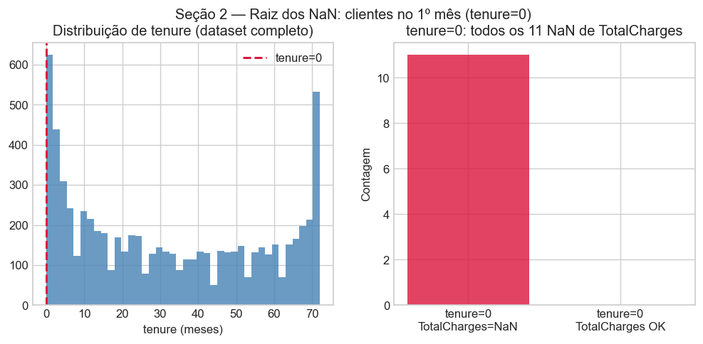
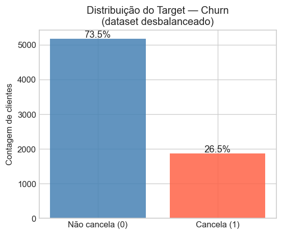
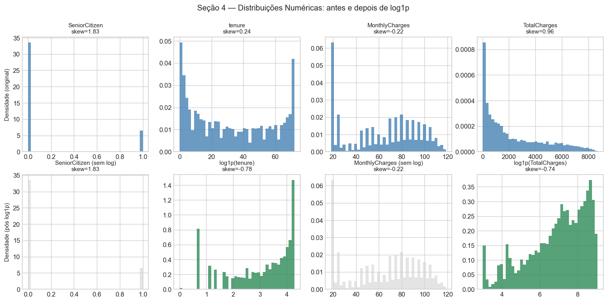
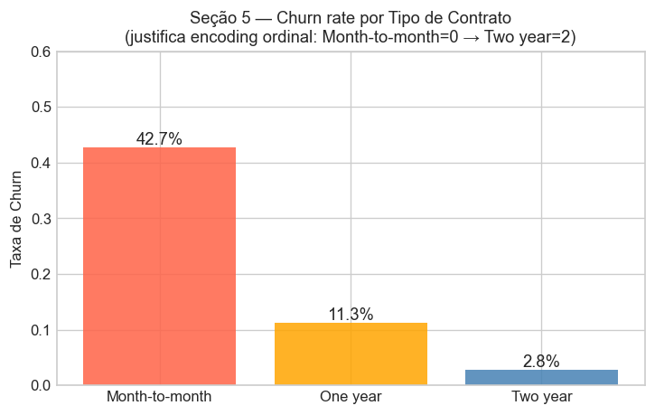
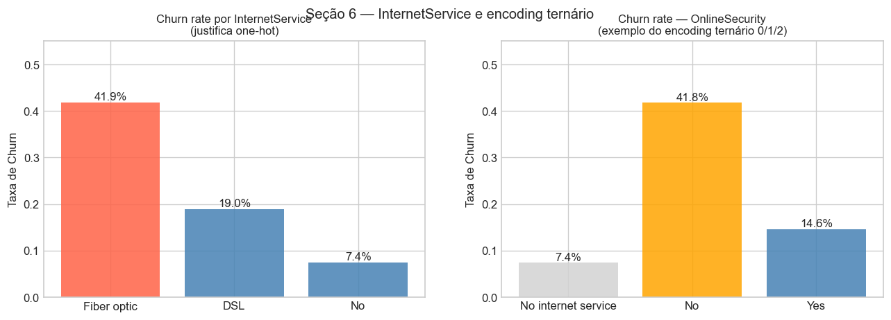
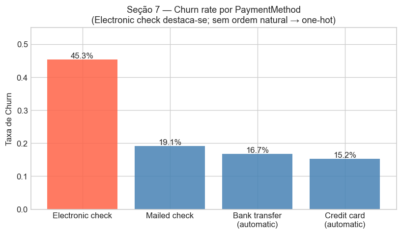
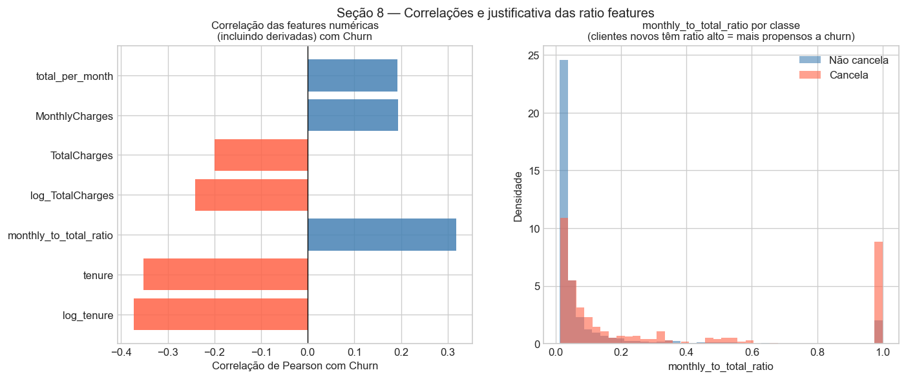
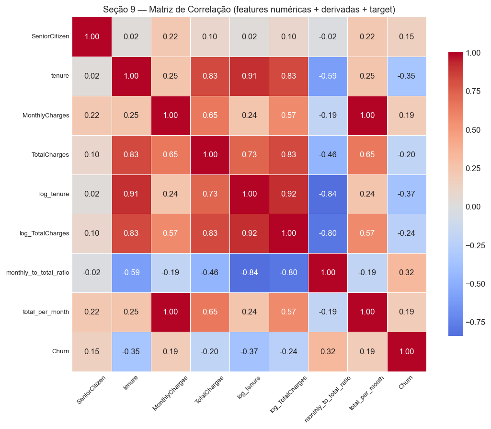
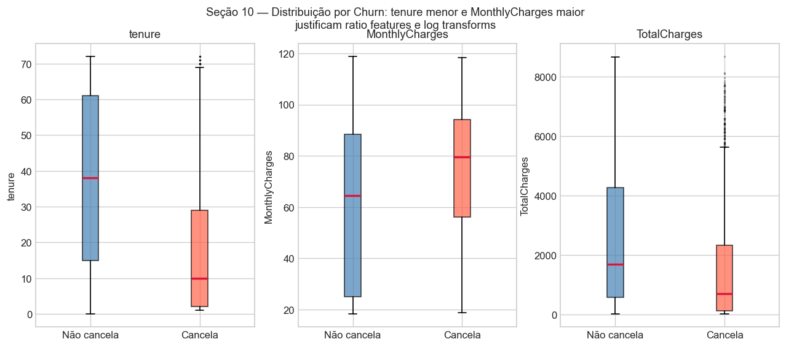

# Relatório de Análise Exploratória — Telco Customer Churn

**Dataset:** [blastchar/telco-customer-churn](https://www.kaggle.com/datasets/blastchar/telco-customer-churn)  
**Arquivo analisado:** `data/processed/telco_customer_churn.parquet`  
**Script:** `eda/eda.py`  
**Objetivo:** Gerar evidências estatísticas que justificam cada decisão do `config/preprocessing.yaml`.

---

## 1. Visão Geral do Dataset

| Atributo | Valor |
|---|---|
| Linhas | 7.043 |
| Colunas | 21 |
| Features numéricas | 3 (tenure, MonthlyCharges, TotalCharges) + 1 binária (SeniorCitizen) |
| Features categóricas | 16 (incluindo customerID e Churn) |
| Variável-alvo | `Churn` (Yes/No) |

**Problema identificado — `TotalCharges` armazenada como `object`:**  
Apesar de representar um valor monetário contínuo, `TotalCharges` é salva como string no CSV original e preservada como `object` no parquet. Após `pd.to_numeric(..., errors='coerce')`, 11 registros resultam em `NaN`.

> **Decisão no preprocessing.yaml:** `type_cast` de `TotalCharges` para `float64` antes de qualquer outra transformação.

---

## 2. Valores Ausentes e Raiz dos NaN

Após a conversão de `TotalCharges`, 11 registros apresentam valor ausente. A investigação revelou que **todos os 11 registros com `TotalCharges=NaN` possuem `tenure=0`** — ou seja, são clientes no primeiro mês de contrato que ainda não receberam nenhuma cobrança acumulada.

| Métrica | Valor |
|---|---|
| `TotalCharges` NaN após conversão | 11 |
| Registros com `tenure=0` | 11 |
| NaN de TotalCharges coincide com `tenure=0` | 100% |

Esses 11 clientes têm `MonthlyCharges` entre R$19,70 e R$80,85 (média de R$41,42), o que confirma que o serviço está ativo — só não há histórico acumulado ainda.

> **Decisões no preprocessing.yaml:**
> - `imputation`: mediana de `TotalCharges` (distribuição assimétrica, skew=0.96 — nunca média)
> - `binary_flag`: `is_new_customer = 1` quando `tenure=0` — captura esse grupo como feature preditiva

---

## 3. Distribuição do Target — Desbalanceamento de Classes

| Classe | Contagem | Proporção |
|---|---|---|
| Não cancela (0) | 5.174 | 73,5% |
| Cancela (1) | 1.869 | 26,5% |

O dataset é **moderadamente desbalanceado**: a classe majoritária (não-churn) representa quase 3x a classe minoritária (churn). Modelos treinados sem tratamento tendem a privilegiar a classe majoritária, elevando o recall de "não cancela" às custas do recall de "cancela" — que é exatamente a classe de interesse do negócio.

> **Impacto no preprocessing.yaml:** o target `Churn` é anotado com a distribuição (73.5%/26.5%) para orientar as etapas de modelagem (ex: `class_weight='balanced'`, SMOTE).

---

## 4. Distribuições Numéricas e Assimetria (Skewness)

| Feature | Skewness | Classificação |
|---|---|---|
| SeniorCitizen | 1.83 | Fortemente assimétrica (binária — não aplicar log) |
| TotalCharges | 0.96 | Moderadamente assimétrica direita |
| tenure | 0.24 | Aproximadamente simétrica |
| MonthlyCharges | -0.22 | Aproximadamente simétrica |

`TotalCharges` apresenta assimetria positiva (skew=0.96), com cauda longa para clientes de longa permanência e alto valor acumulado. A transformação `log1p` reduz o impacto desses outliers e melhora a linearidade com o target em modelos sensíveis à escala (Regressão Logística, SVM).

`tenure` tem skewness baixa, mas a transformação log é incluída porque a separação entre classes (ver Seção 10) é mais pronunciada na escala log.

`SeniorCitizen` é binária (0/1) — transformação logarítmica não se aplica.

> **Decisão no preprocessing.yaml:** `log_transform` em `TotalCharges` e `tenure`. `MonthlyCharges` e `SeniorCitizen` permanecem na escala original.

---

## 5. Churn Rate por Tipo de Contrato

| Contrato | Taxa de Churn | N |
|---|---|---|
| Month-to-month | **42,7%** | 3.875 |
| One year | 11,3% | 1.473 |
| Two year | **2,8%** | 1.695 |

Existe uma **hierarquia natural clara**: contratos mais longos estão fortemente associados à retenção. A diferença entre Month-to-month (42,7%) e Two year (2,8%) é de quase 40 pontos percentuais — a maior diferença entre categorias de qualquer feature do dataset.

Essa ordenação natural descarta a necessidade de one-hot encoding (que não capturaria a ordinalidade) e valida a escolha de encoding ordinal com a ordem crescente de fidelidade.

> **Decisão no preprocessing.yaml:** `Contract` recebe encoding ordinal — Month-to-month=0, One year=1, Two year=2. A ordem reflete diretamente o risco de churn decrescente.

---

## 6. InternetService e Colunas com "No Service"

### 6.1 Churn rate por InternetService

| InternetService | Taxa de Churn | N |
|---|---|---|
| Fiber optic | **41,9%** | 3.096 |
| DSL | 19,0% | 2.421 |
| No | 7,4% | 1.526 |

As três categorias têm taxas de churn muito distintas e **sem ordenação cardinal** (Fiber optic tem maior churn que DSL, não necessariamente por ser "mais" de alguma coisa — possivelmente insatisfação com custo/qualidade da fibra). One-hot encoding é a escolha correta.

### 6.2 Encoding ternário — colunas com "No internet service"

As colunas `OnlineSecurity`, `TechSupport`, `StreamingTV` e similares possuem três valores: "No internet service", "No" e "Yes". A tabela abaixo mostra que **existe hierarquia real nas taxas de churn**:

| Feature | Valor | Taxa de Churn |
|---|---|---|
| OnlineSecurity | No internet service | 7,4% |
| OnlineSecurity | No | **41,8%** |
| OnlineSecurity | Yes | 14,6% |
| TechSupport | No internet service | 7,4% |
| TechSupport | No | **41,6%** |
| TechSupport | Yes | 15,2% |
| StreamingTV | No internet service | 7,4% |
| StreamingTV | No | 33,5% |
| StreamingTV | Yes | 30,1% |

"No internet service" agrupa clientes sem acesso à internet (mesma taxa de churn: 7,4% — idêntica ao grupo "No" de InternetService). "No" significa "tem internet mas não contratou o serviço adicional" — esse grupo tem o maior churn, sugerindo insatisfação com a oferta. "Yes" tem churn intermediário.

A hierarquia 0 < 2 < 1 em termos de risco (No service < Yes < No) é real e pode ser capturada com o mapeamento ordinal 0/1/2.

> **Decisões no preprocessing.yaml:**
> - `InternetService`: one-hot (sem ordenação natural entre as 3 categorias)
> - Colunas ternárias: ordinal — "No internet service"=0, "No"=1, "Yes"=2

---

## 7. Churn Rate por Método de Pagamento

| PaymentMethod | Taxa de Churn | N |
|---|---|---|
| Electronic check | **45,3%** | 2.365 |
| Mailed check | 19,1% | 1.612 |
| Bank transfer (automatic) | 16,7% | 1.544 |
| Credit card (automatic) | 15,2% | 1.522 |

`Electronic check` destaca-se com 45,3% de churn — quase o triplo dos métodos automáticos. Uma hipótese é que clientes que pagam manualmente (cheque eletrônico ou mailed check) têm menor comprometimento com o serviço. Contudo, não há ordenação cardinal entre os 4 métodos — mailed check não é "mais" do que bank transfer de forma mensurável.

> **Decisão no preprocessing.yaml:** `PaymentMethod` recebe one-hot encoding (4 dummies, sem `drop_first` — todas as categorias são mantidas para interpretação).

---

## 8. Correlações com o Target e Features Derivadas

Correlações de Pearson entre as features numéricas (originais e derivadas) e `Churn`:

| Feature | Correlação com Churn |
|---|---|
| log_tenure | **-0.373** |
| tenure | -0.352 |
| monthly_to_total_ratio | **+0.319** |
| log_TotalCharges | -0.242 |
| TotalCharges | -0.200 |
| MonthlyCharges | +0.193 |
| total_per_month | +0.192 |

**Observações principais:**

- `log_tenure` supera `tenure` em correlação (-0.373 vs -0.352): a transformação logarítmica melhora a relação linear com o target, justificando o log transform.
- `monthly_to_total_ratio` (MonthlyCharges / TotalCharges) é a **terceira feature mais correlacionada** (+0.319), superior às features brutas. Clientes no início do contrato têm ratio alto (TotalCharges baixo) e maior propensão ao churn — o ratio captura essa dinâmica de forma mais direta que as features isoladas.
- `total_per_month` (TotalCharges / tenure) é essencialmente o MonthlyCharges histórico médio do cliente, com correlação similar a MonthlyCharges mas calculada sobre o histórico real.
- `TotalCharges` tem correlação **negativa** com churn (-0.200): clientes com mais histórico acumulado (mais tempo) tendem a não cancelar — efeito confundido com tenure.

> **Decisões no preprocessing.yaml:**
> - `log_transform` em `tenure` e `TotalCharges` (melhoram a correlação linear)
> - `ratio_features`: `monthly_to_total_ratio` e `total_per_month` (adicionam informação não capturada pelas features brutas)

---

## 9. Matriz de Correlação entre Features Numéricas

O heatmap completo (Seção 9 do EDA) revela:

- **tenure ↔ TotalCharges**: correlação alta (+0.83) — esperada, pois clientes mais antigos acumulam mais cobranças. As features derivadas (`monthly_to_total_ratio`, `total_per_month`) adicionam informação ortogonal a esse par.
- **log_tenure ↔ log_TotalCharges**: correlação ainda alta (+0.81) — mesma relação estrutural, mas em escala log.
- **monthly_to_total_ratio ↔ tenure**: correlação negativa forte (-0.84) — clientes novos têm ratio alto. Isso confirma que o ratio captura a "fase do contrato" de forma mais explícita que tenure isolado.
- **MonthlyCharges ↔ TotalCharges**: correlação moderada (+0.65) — clientes com planos mais caros acumulam mais, mas há variação pelo tempo de permanência.

A multicolinearidade entre tenure e TotalCharges é conhecida e esperada; modelos baseados em árvores são robustos a isso. Para modelos lineares, as versões log e os ratios mitigam o problema ao capturar relações distintas.

---

## 10. Boxplots por Classe — Confirmação Visual

Os boxplots das features numéricas por classe de Churn confirmam os padrões observados nas correlações:

| Feature | Mediana — Não cancela | Mediana — Cancela | Interpretação |
|---|---|---|---|
| tenure | ~38 meses | ~10 meses | Clientes que cancelam têm histórico muito mais curto |
| MonthlyCharges | ~64 R$ | ~79 R$ | Clientes que cancelam pagam planos mais caros |
| TotalCharges | ~1.687 R$ | ~703 R$ | Reflete o tenure menor (menos tempo = menos acumulado) |

A diferença de tenure entre as classes é a mais pronunciada, com medianas quase 4x distintas. Isso reforça que o tempo de relacionamento com a empresa é o preditor mais forte — e que o ratio `monthly_to_total_ratio` (que cresce quando tenure é baixo) captura essa dinâmica de forma complementar.

> **Confirmação:** as ratio features `monthly_to_total_ratio` e `total_per_month` são features derivadas válidas para inclusão no `features_to_keep` do preprocessing.yaml.

---

## Resumo das Decisões Justificadas

| Decisão no preprocessing.yaml | Seção | Evidência |
|---|---|---|
| `type_cast` TotalCharges → float64 | 1 | dtype original é `object` no parquet |
| `imputation` mediana em TotalCharges | 2 | 11 NaN com distribuição assimétrica (skew=0.96) |
| `binary_flag` is_new_customer (tenure=0) | 2 | 100% dos NaN pertencem ao grupo tenure=0 |
| Nota de desbalanceamento 73.5%/26.5% | 3 | Value counts do target |
| `log_transform` TotalCharges e tenure | 4, 8 | skew=0.96; log melhora correlação -0.352→-0.373 |
| `Contract` encoding ordinal (0/1/2) | 5 | Churn 42.7% → 11.3% → 2.8%: hierarquia clara |
| `InternetService` one-hot | 6 | 3 categorias sem ordenação natural |
| Encoding ternário (0/1/2) para colunas "No service" | 6 | Churn varia por nível: 7.4% < 14.6% < 41.8% |
| `PaymentMethod` one-hot | 7 | 4 categorias sem ordenação, Electronic check destoa |
| `ratio_features` monthly_to_total e total_per_month | 8, 10 | Correlação +0.319 com Churn; ortogonal às features brutas |
| `binary_encoding` para colunas Yes/No | 6, 7 | Todas as binárias têm variação de churn relevante |
